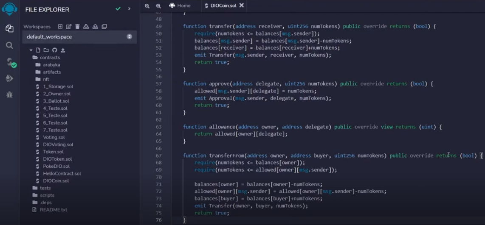
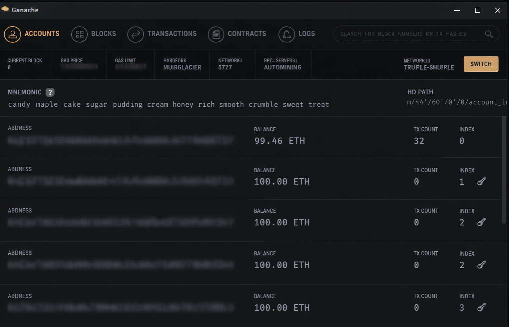
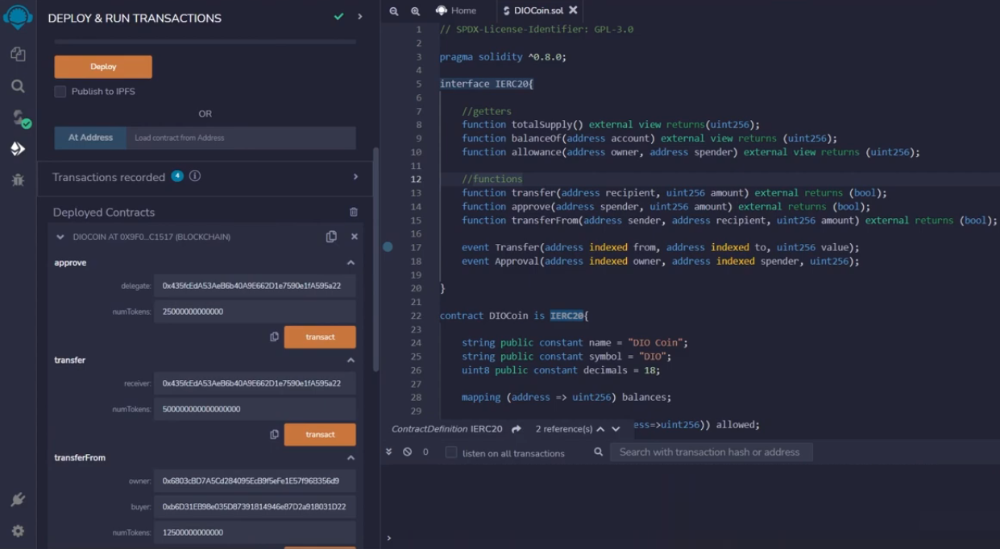

Daily learning

# Creating Your First Cryptocurrency on the Ethereum Network

Project developed at the Bootcamp Blockchain Specialist Training, under the guidance of specialist [Cassiano Peres](https://github.com/cassianobrexbit/ "Cassiano Peres").

Learning how to develop tokens in the ERC-20 standard,
with Solidity and using smart contracts on the Ethereum network.

Technologies used:

- [Solidity](https://www.soliditylang.org/)
- [Truffle](https://archive.trufflesuite.com/)
- [Ganache](https://archive.trufflesuite.com/ganache/)
- [Remix IDE](https://remix.ethereum.org/#lang=en&optimize&runs=200&evmVersion&version=soljson-v0.8.34+commit.80d5c536.js)
- [Metamask](https://chromewebstore.google.com/detail/metamask/nkbihfbeogaeaoehlefnkodbefgpgknn)

Challenge steps:

1. Implement the ERC-20 token

2. Publish on the blockchain

3. Receive and send transactions

[LICENSE](/LICENSE)

See [original repository](https://github.com/cassianobrexbit/bitcoin-dio)
